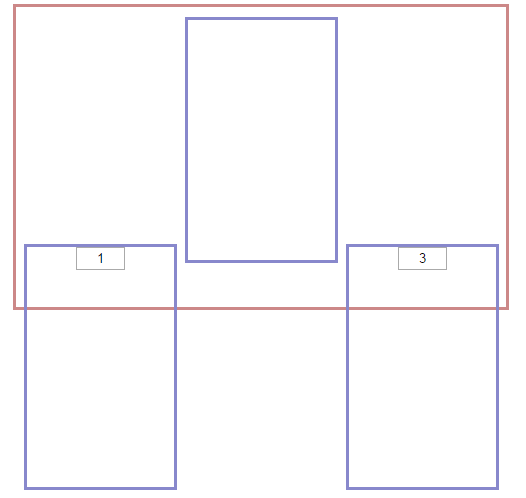

inline-block并列排序时候的影响
当两个设置了inline-block属性的元素并列排放时，它们的位置能够互相影响。

元素结构：

      

    
        

    
            1
    
        

    
        

    
            <!-- 2 -->
    
        

    
        

    
            3
    
        

    
      

我们使三个div都设置为 inline-block，设置宽度使其居于一行内。如果再把 container-demo2 中的内容注释掉，我们可以看到一种十分诡异的情况，如图。

 

可以发现本该位于父容器顶端的demo1和demo3居然沉了下去，而没有内容的demo2还在正常位置上。这时候就会想：肯定是元素的内容造成了这种结果。那么我们现在给demo2加上内容看看效果：

 

可以看到三个元素都回到了我们想让它呈现的位置。那为什么inline-block元素的位置会受到其内容的影响呢？我们可以查到这样一句话：inline-block元素可以将对象呈递为内联对象，但是对象的内容作为块对象呈递。有了这样的属性，我们就可以在表现上将对象用作内敛元素但又可以对它进行宽高设置。但有一点需要注意的是对象仍然呈递为内联元素，而同一行内的内联元素默认是基于 baseline 对齐的，我们可以在1图中标记出来：

 

即图中的蓝色线条，具体的我们可以去查看W3C的 vertical-align 属性。好的，基于基线对齐的模式我们有了理解，但还有一个问题：为什么3个元素的方向不是相同的呢？为什么有内容的元素向下，而无内容的元素会向上呢？就此我们需要了解CSS渲染机制：对于一个inline-block元素，如果内部没有inline内联元素，或者overflow不是visible，则该元素的基线就是它margin的底边缘，否则就是元素内部最后一行内联元素的基线。

简单地就以上这种情况来说，没有内容的demo2会基于它的margin底边缘也就是它的下边缘对齐，而包含内容的demo1和demo3会基于其内部内联元素的基线对齐，所以会造成这种一上一下的情况。

解决办法：

1、暴力float，当然这是备选方案，毕竟脱离文档流后页面元素会不好控制

2、简单粗暴地给所有元素都加上内容，例如空格符

3、设置所有内联元素 vertical-align: top/middle/bottom; 属性，改变默认设置
