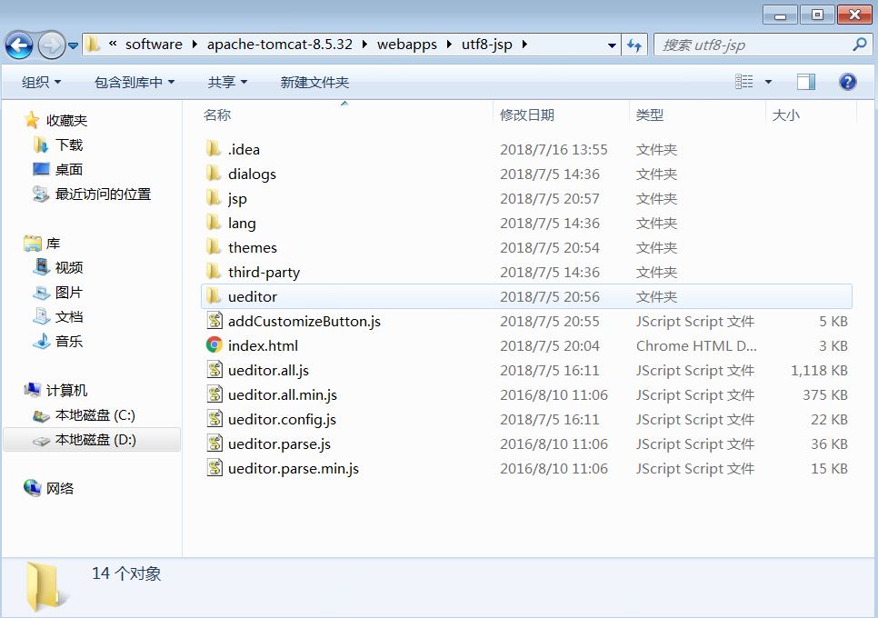
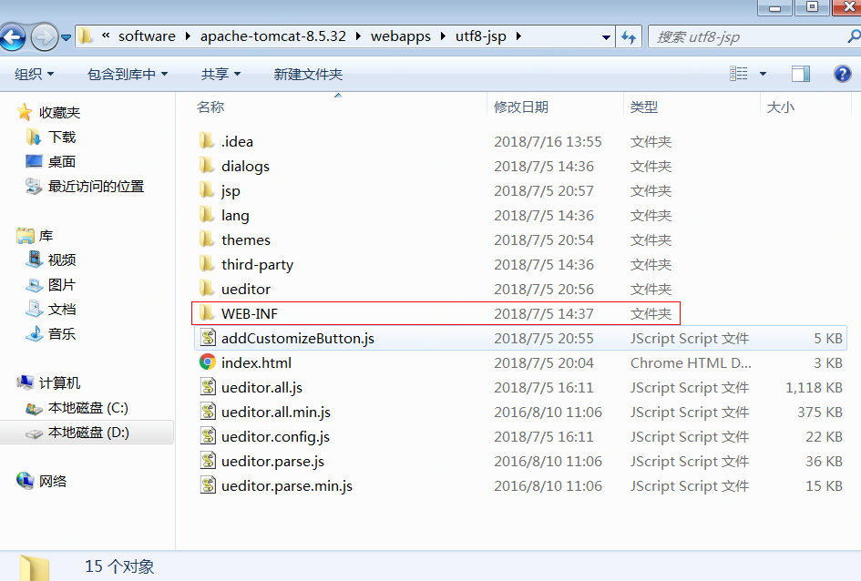
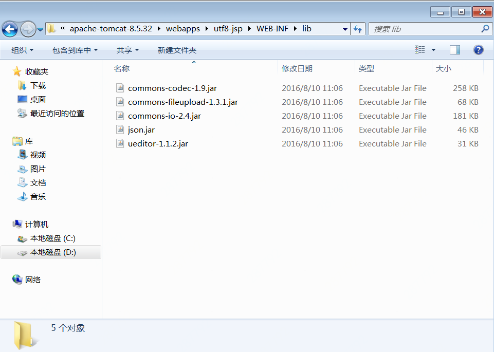
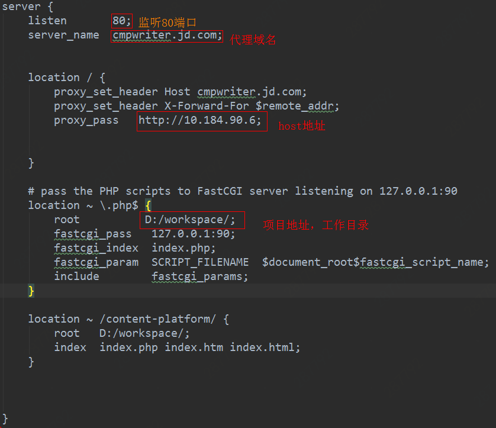
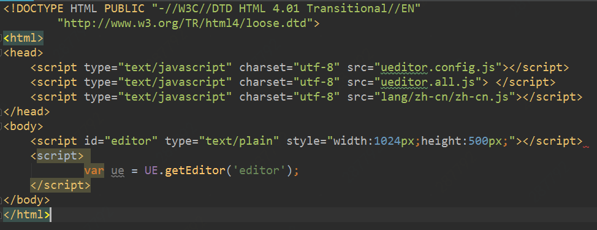
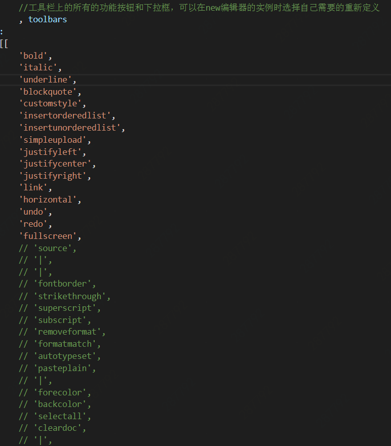
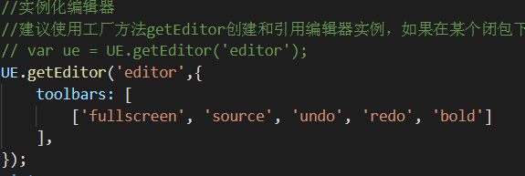
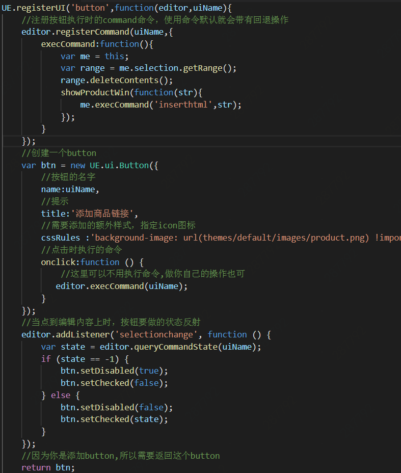
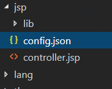
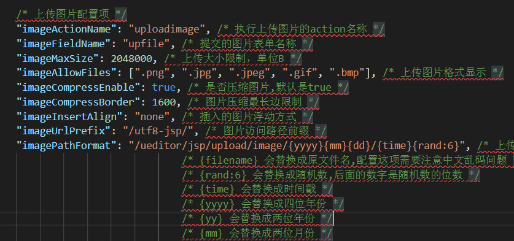

UEditor使用手册

配置jdk 1.6+
Apache Tomcat6.0+
Ueditor官网下载
 

部署

安装好jdk和apache后，我们开始部署代码
我们在apache的安装目录下，找到webapps的这个文件夹，如下图1-1所示，然后我们将官网上下载的ueditor放到webapps下，官网上下载的代码可能是外面包了文件夹，我们只保留最底层的文件夹，例如图1-2
 

图1-1

图1-2

然后我们在utf8-jsp这个文件夹里建一个新的文件夹WEB-INF，如图1-3所示，它里面包括lib文件夹，同时将jsp文件夹下的lib文件夹下的所有jar包复制到我们自己新建的WEB-INF下的lib里，如图1-4所示。
 

图1-3

图1-4

到这里我们基本就部署完毕了，这个时候启动tomcat,就是bin文件夹下的startup.bat,这里需注意我们的nginx是否启动，如果启动一定要关掉，不然tomcat会报错。
如果你不想采用这种方式来配置，那我们可以用nginx代理来搞这件事，比如我找到了一个域名，以cmpwriter.jd.com为例，我配置了相关信息如下图1-5所示。同时在host文件中添加127.0.0.1。
 

图1-5

 

初始化
我们在页面引入相关文件，然后利用工厂模式初始化编辑器。

 

配置项更改
Ueditor.config.js中，可以对工具栏想要选择的按钮进行自行选择，同时文件中还有其他配置项可以自行配置，注释很清楚，例如主题配置项，自动保存开启等等，配置的参数一般为默认值，及时注释也会按照默认值来配置。

 

也可以通过实例化时传入参数，这种更好些，例子如下

 

自定义配置按钮
首先我们将按钮图片放在themes下的images下，然后可以选择在源码中修改，但不建议这种修改方式，此处不过多介绍。可以重新写一个js用做编辑器的配置。如下

 

Showproductwin是对这个按钮进行各种操作的一个函数，我这里是对编辑器内容增加，在这个函数里，必须存在的是参数fn，以及对fn的执行，看到红线框部分的内容其实是一个字符串。他会执行按钮注册时的方法，将这个字符串通过inserthtml插入到编辑器中，这是最常用的方式没有之一。

UEditor提供了registerUI这个接口，可以动态的注入扩展的内容。

uiname,是你为新添加的UI起的名字，这里可以是1个或者多个，“uiname”后者是“uiname1 uiname2 uiname3”。function，是实际你要做的事情，这里提供两个参数，editor是编辑器实例，如果你有多个编辑器实例，那每个编辑器实例化后，都会调用这个function,并且把editor传进来

uiname,你为ui起的名字，如果前边你添加的是多个的化，这里function会被调用多次，并且将每一个ui名字传递进来.

如果函数返回了一个UI 实例，那这个UI实例就会被默认加到工具栏上。当然也可以不返回任何UI。比如希望监控selectionchange事件，在某些场景下弹出浮层，这时就不需要返回任何UI.

index,是你想放到toolbar的那个位置，默认是放到最后editorId,当你的页面上有多个编辑器实例时，你想将这个ui扩展到那个编辑器实例上，这里的editorId是给你编辑器初始化时，传入的id,默认是每个实例都会加入你的扩展

二次开发组件化
比如我们在编辑器内插入一段商品详情，我们会发现在删除的时候，并不能直接删除这一块商品详情，因为ueditor将这一部分的内容转换成了html，所以我们需要给这一部分的内容加上如下属性：

tabindex=“-1”

contenteditable=“false”

ondrag=“return false”

ondragstart=“return false”

然后再是一下你会发现页面元素并没有加上，这是因为ueditor对自定义属性标签做了限制，所以我们去找到ueditor.config.js里找到whitList,找到你想要设置的标签，在后面加上这些属性即可

同时要将阻止div标签变成p标签，UEditor对于进入编辑器中的数据进行的过滤处理。在UEditor中表示段落的标签是p标签，很多的编辑操作都是基于p标签进行的处理。allowDivTransToP: false即可

图片上传路径配置

 

经常会发现已启动的时候疯狂报错，什么后端配置项不正确，图片上传成功但显示不出来，不要怕，很正常。打开上述文件，会发现很多配置项，如下图所示：

 

这里可以一顿配置，imageUrlPrefix的意思就是图片访问路径前缀，如果图片显示不出来就是这个玩意没配对。
