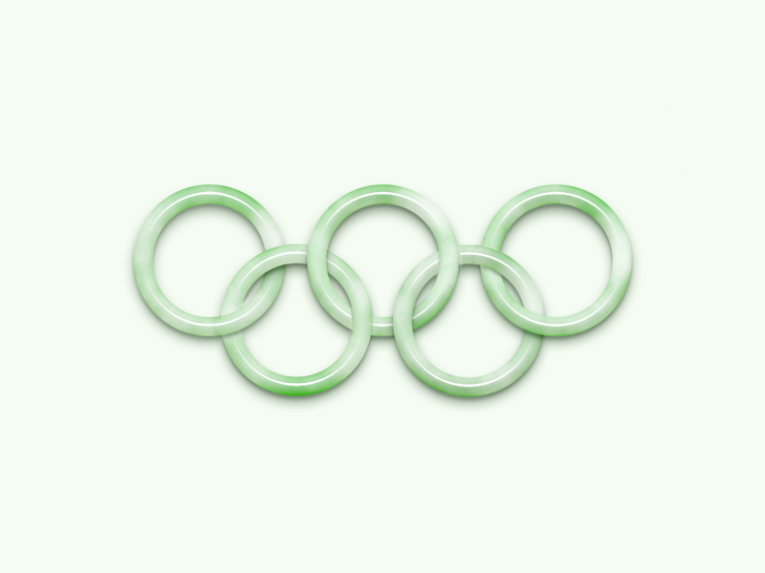
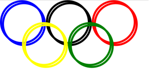
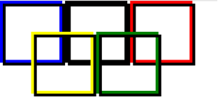
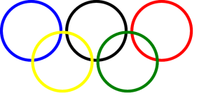
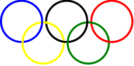
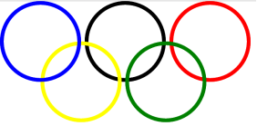
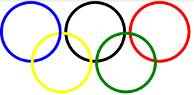

今年夏天我守在电视旁边看了所有能看的奥运比赛,到现在我都记得孙杨那场比赛.卧槽老娘简直被孙杨燃炸了!!!最近又在朋友圈里看到了孙杨来录制节目,想想做个五环玩玩吧.

首先,五环的特点是五个圆,并且是一个套着一个,看图

通过立体图能看出来五环某些边的层叠关系,怎么用css实现?思路是这样的,第一步做5个圆,但是这种一个套着一个的样式不可能是一个div就可以实现的,所以再弄五个一模一样的圆放在上面,通过改变z-index和透明度来实现.

第一步:做五个圆

HTML部分代码

    

    

    

    

    

CSS样式部分代码
    
    .circle{
        width: 200px;
        height: 200px;
        border-radius: 50%;
        border-width: 10px;
        border-style: solid;
        position: absolute;
    }
    .blue{
        border-color: blue;
        top: 0;
        left: 0;
    }
    .black{
        border-color: black;
        top: 0;
        left: 230px;
    }
    .red{
        border-color: red;
        top: 0;
        left: 460px;
    }
    .yellow{
        border-color: yellow;
        top: 110px;
        left: 110px;
    }
    .green{
        border-color: green;
        top: 110px;
        left: 340px;
    }

运行结果

此时的五环是没有一个套一个的样式的,我们向每一个圆里插入一个一样的圆,用到的是css3中的::after

CSS代码

    .circle, .circle::after{
        width: 200px;
        height: 200px;
        border-radius: 50%;
        border-width: 10px;
        border-style: solid;
        position: absolute;
    }
    .circle::after{
        content: "";
    }
    .blue{
        border-color: blue;
        top: 0;
        left: 0;
    }
    .blue.circle::after{
        border-color: blue;
    }
    .black{
        border-color: black;
        top: 0;
        left: 230px;
    }
    .black.circle::after{
        border-color: black;
    }
    .red{
        border-color: red;
        top: 0;
        left: 460px;
    }
    .red.circle::after{
        border-color: red;
    }
    .yellow{
        border-color: yellow;
        top: 110px;
        left: 110px;
    }
    .yellow.circle::after{
        border-color: yellow;
    }
    .green{
        border-color: green;
        top: 110px;
        left: 340px;
    }
    .green.circle::after{
        border-color: green;
    }

运行结果:

在插入同样元素的时候,发现并没有与原来的元素重合,我们把边框圆角去掉,并且把所有的后插入的元素边框设置为黑色,再看一下.

 

这是因为在内容中插入.所以让所有后插入的元素定位left和top都为-10px.代码如下

    .circle::after{
        content: "";
        left: -10px;
        top: -10px;
    }

然后开始改变层叠关系,下图为改变后的五环图

对比后,首先改变蓝色右边和黄色交叉的地方,让后插入的蓝色的右边框z-index变为1,然后运行

 

再改变蓝色下方和黄色交叉的地方,把后插入的蓝色下边框设为透明,语法为border-bottom-color,透明的属性为transparent.运行

 

同理,可以设置后面的圆环样式,完整css样式代码如下

    .circle, .circle::after{
        width: 200px;
        height: 200px;
        border-radius: 50%;
        border-width: 10px;
        border-color: black;
        border-style: solid;
        position: absolute;
    }
    .circle::after{
        content: "";
        left: -10px;
        top: -10px;
    }
    .blue{
        border-color: blue;
        top: 0;
        left: 0;
    }
    .blue.circle::after{
        border-color: blue;
        z-index: 1;
        border-bottom-color: transparent;
    }
    .black{
        border-color: black;
        top: 0;
        left: 230px;
    }
    .black.circle::after{
        border-color: black;
        z-index: 1;
        border-left-color: transparent;
    }
    .red{
        border-color: red;
        top: 0;
        left: 460px;
    }
    .red.circle::after{
        border-color: red;
        z-index: 2;
        border-left-color: transparent;
    }
    .yellow{
        border-color: yellow;
        top: 110px;
        left: 110px;
    }
    .yellow.circle::after{
        border-color: yellow;
    }
    .green{
        border-color: green;
        top: 110px;
        left: 340px;
    }
    .green.circle::after{
        border-color: green;
        z-index: 1;
        border-top-color: transparent;
    }
