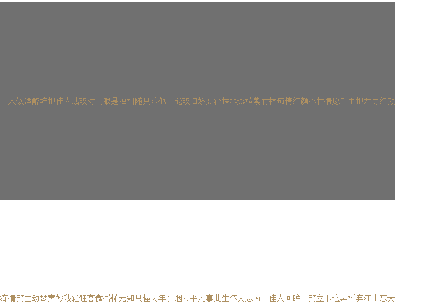
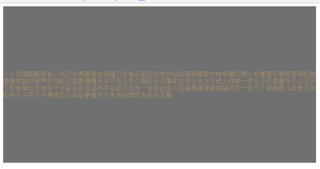
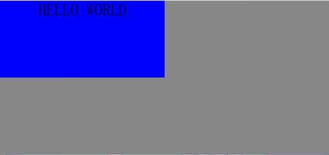
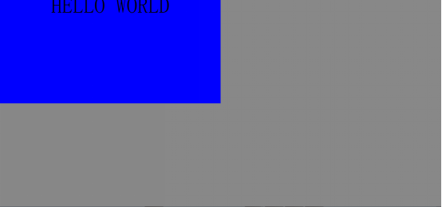

单行文字居中,通过line-height=height的方式垂直居中

代码如下

    #content{
        width: 800px;
        height:400px;
        color: #ae9061;
        background: #707070;
        line-height: 400px;
    }

多行文字代码如下

    

       

           一人饮酒醉醉把佳人成双对两眼是独相随只求他日能双归娇女轻扶琴燕嬉紫竹林痴情红颜心甘情愿千里把君寻红颜痴情笑曲动琴声妙我轻狂高傲懵懂无知只怪太年少烟雨平凡事此生怀大志为了佳人回眸一笑立下这毒誓弃江山忘天下斩断情丝无牵挂千古留名传佳话两年征战以白发一生征战何人陪谁是谁非谁相随戎马一生为了谁能爱几回恨几回败帝王斗苍天夺得皇位以成仙豪情万丈天地间续写另类帝王篇
       

    

样式代码

    #content{
        width: 800px;
        height:400px;
        color: #ae9061;
        background: #707070;
    }

运行后并不能达到我们预期效果，没有居中

 

方法一:用line-height=height做,示例如下

因为line-height针对的是单行文字,并不适用多行文字,不妥

方法二: 利用table

CSS代码

    #content{
        width: 800px;
        height:400px;
        color: #ae9061;
        background: #707070;
        display: table;
    }
    #content p{
        display: table-cell;
        vertical-align: middle;
    }

运行后

以上达到了我们想要的效果

但设置高度为百分比时,也想让文字垂直居中,于是有了下面这段代码

    <!DOCTYPE html>
    <html>
    <head lang="en">
        <meta charset="UTF-8">
        <title></title>
        
    </head>
    <body>
    

        

            HELLO WORLD
        

    

    </body>
    </html>

此时我没有设置任何让它垂直居中的样式,运行如下

 

然后利用line-height:50%,看看发生什么

并不是我截图截丢了一块,发现字体向上移了一部分,原因是line-height的百分比是相对于font-size的,所以你如果使用line-height居中的话,就必须使用绝对的px值

方法一:

增加一个父元素,给父元素设置display:table,给需要居中的元素设置vertical-align:middle;display:table-cell;

方法二:

给需要居中的元素加以下代码样式和

display:flex;

justify-content:center;

align-items:center;

两种方法在不同场景都有一定程度的问题,需根据实际情况确定

 

小技巧tips:

设置高度宽度百分比时,百分比时相对于父元素来确定,承接父元素的百分比,相对于浏览器屏幕大小时,必须给html,body设置显性百分比100%
